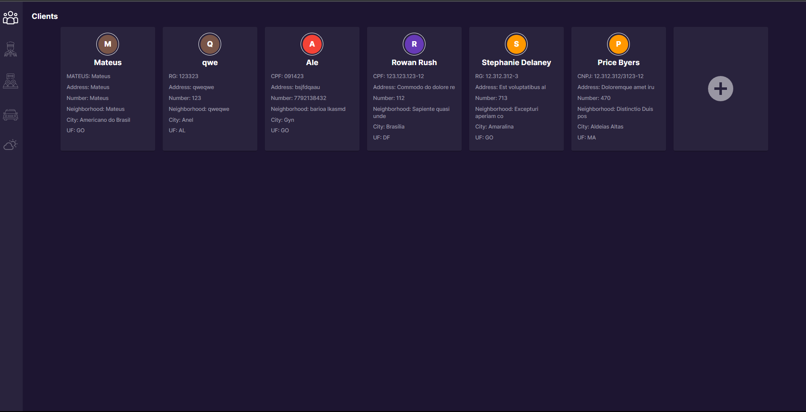
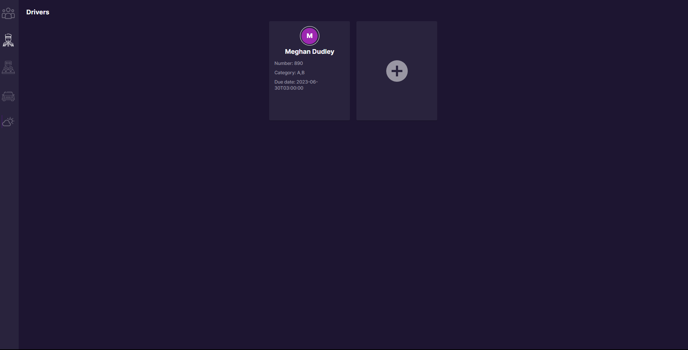
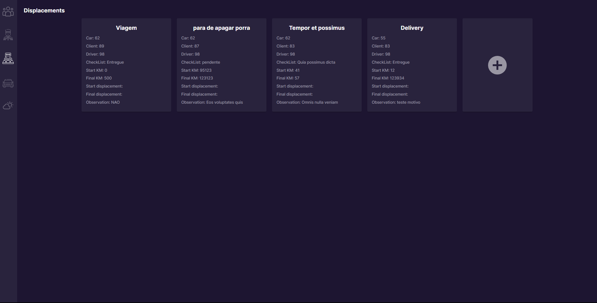
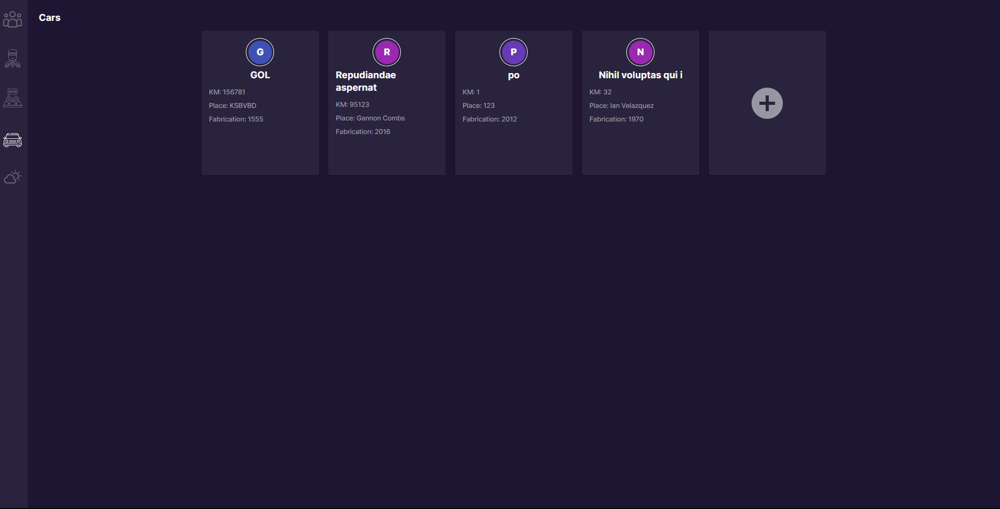
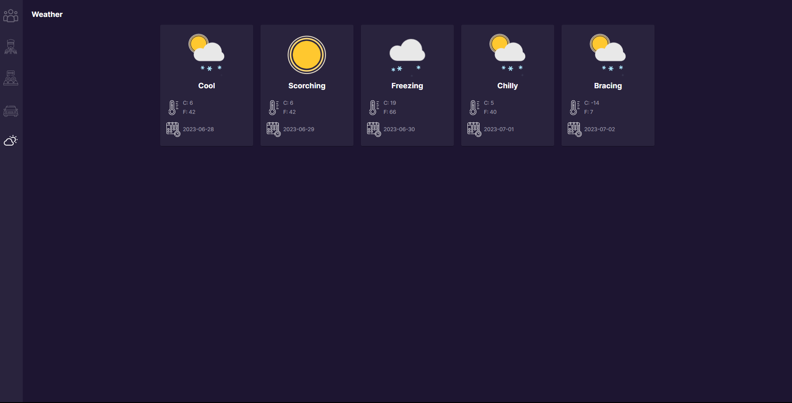

# Challenger_next

## Principais Tecnologias utilizadas

- Next
- Typescript
- Material UI

## Instalação

- Clone o repositório com
  ```
  git clone https://github.com/Junior331/challenge_next
  ```
- É necessario ter o Node 10.13 ou superior instalado
- Para iniciar o servidor de desenvolvimento rode os comandos abaixo

```
yarn or npm
npm run dev
```

#### Apresentação 
Desenvolver uma aplicação front-end utilizando Next.js com TypeScript e a biblioteca Material-UI, que permita aos usuários interagir com a API Deslocamento para realizar operações relacionadas a clientes, condutores, deslocamentos e veículos. A aplicação deve fornecer interfaces para criar, visualizar, atualizar e excluir registros em cada uma dessas entidades, seguindo as melhores práticas e padrões de desenvolvimento.
## App

#### O Produto
 #Clints
 
 #Drivers
 
 #Displacements
 
 #Cars
 
 #Weathers
 